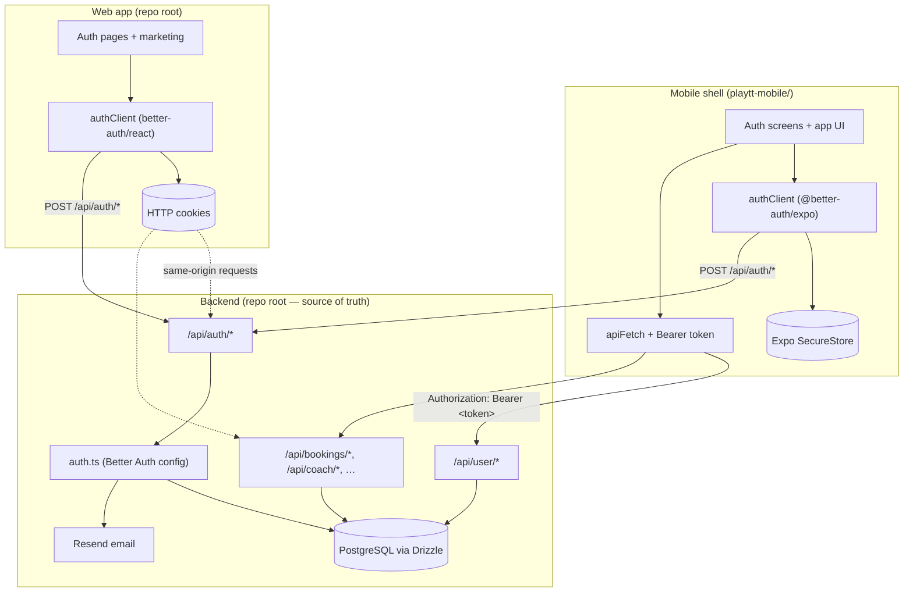

# PlayTT Authentication Architecture

Handoff guide for agents implementing the same auth pattern in another project.

**Core rule:** the **Next.js backend owns everything** — users, sessions, passwords, OAuth, email OTP, database, and all protected APIs. The **Expo mobile app is a thin shell**: native UI + local session storage + HTTP calls to the backend. It does not run its own auth server or database.

---

## System overview



| Layer | Role | Session transport |
|-------|------|-----------------|
| **Backend** | Creates users/sessions, sends email, validates every request | N/A |
| **Web** | Marketing + account pages on same domain as API | HTTP cookies (Better Auth default) |
| **Mobile** | Native UI only; no local user DB | `Authorization: Bearer <session.token>` |

---

## Tech stack

| Piece | Library / service |
|-------|-------------------|
| Auth server | [Better Auth](https://www.better-auth.com/) `^1.6.x` |
| Mobile bridge | `@better-auth/expo` |
| ORM | Drizzle + PostgreSQL |
| Email OTP / reset | Better Auth `emailOTP` plugin + Resend |
| 2FA | Better Auth `twoFactor` plugin |
| Mobile token storage | `expo-secure-store` |

---

## Backend files (implement these first)

These live at the **repo root** (Next.js app). Copy/adapt this set before building any client.

### Core config

| File | Purpose |
|------|---------|
| `auth.ts` | **Single source of auth truth.** Better Auth instance: Drizzle adapter, `emailAndPassword`, Google/Apple providers, `expo()` plugin, `emailOTP`, `twoFactor`, `trustedOrigins`, session TTL, email sending via Resend. |
| `db/schema.ts` | Better Auth tables: `user`, `session`, `account`, `verification`, `two_factor`. PlayTT extends `user` with profile/onboarding fields. |
| `db/drizzle.ts` | Database client passed to Drizzle adapter. |
| `src/app/api/auth/[...all]/route.ts` | Mounts Better Auth on `/api/auth/*` via `toNextJsHandler(auth)`. All sign-in/sign-up/OAuth/OTP endpoints hit here. |
| `src/lib/security.ts` | **`getSessionWithBearerFallback(req)`** — resolves session from cookies (web) **or** `Authorization: Bearer` (mobile). Required on every API route the mobile app calls. |
| `src/lib/web-cors-origins.ts` | Pure exact-origin policy merged into `trustedOrigins`: official HTTPS production defaults, development localhost, and validated configured web origins. |
| `src/lib/trusted-auth-origins.ts` | Pure trusted-origin policy: permanent PlayTT/web/Apple origins, environment-gated Expo wildcard defaults, and validated exact mobile callbacks. |

### User bootstrap APIs (mobile depends on these)

| File | Purpose |
|------|---------|
| `src/app/api/user/me/route.ts` | `GET` — returns user profile, auth methods, session metadata, and `route` (where to send user after login). Uses bearer fallback. |
| `src/app/api/user/onboarding/route.ts` | `PATCH` — saves onboarding steps; sets `onboardingCompletedAt`. |
| `src/app/api/user/profile/route.ts` | `PATCH` — profile updates after onboarding. |
| `src/server/users/onboarding.ts` | `getUserProfileById`, `resolvePostAuthRoute` — backend decides post-auth navigation. |
| `src/server/users/profile.ts` | Serialization + `getUserAuthMethods` (credential / google / apple). |

### Apple native sign-in (mobile-specific backend route)

| File | Purpose |
|------|---------|
| `src/app/api/apple/sign-in/route.ts` | `POST` — verifies Apple `identityToken`, upserts user + account, creates `session` row, returns `{ user, token }`. Mobile stores token in SecureStore. |
| `src/lib/verify-apple-token.ts` | JWT verification against Apple JWKS. |

### Email templates

| File | Purpose |
|------|---------|
| `src/lib/email/render-otp-email.ts` | HTML for verification, reset, 2FA OTP emails. |
| `src/emails/*` | React Email templates (if used). |

### Web-only helpers (optional for mobile-only port)

| File | Purpose |
|------|---------|
| `src/lib/auth-client.ts` | `createAuthClient` for React web (`better-auth/react` + OTP/2FA client plugins). |
| `src/actions/auth-actions.ts` | Server Actions that POST to `/api/auth/email-otp/*` for verify/reset flows on web. |
| `src/components/auth/*` | Sign-in, sign-up, verify-email, reset-password UI. |
| `src/app/sign-in/page.tsx`, `sign-up/`, etc. | Web auth routes. |

### Protected domain APIs (pattern)

Every route under `src/app/api/**` that mobile calls must start with:

```ts
import { getSessionWithBearerFallback } from "@/lib/security"

export async function GET(req: NextRequest) {
  const session = await getSessionWithBearerFallback(req)
  if (!session) {
    return NextResponse.json(
      { code: "UNAUTHENTICATED", message: "Sign in is required." },
      { status: 401 },
    )
  }
  // use session.user.id
}
```

**Do not** use only `auth.api.getSession()` on mobile-facing APIs — native apps do not send cookies.

Examples already using bearer fallback: `api/bookings/*`, `api/coach/*`, `api/replays/*`, `api/user/*`.

Web **server pages** (e.g. `src/app/account/page.tsx`) may use `auth.api.getSession({ headers })` because they run same-origin with cookies.

---

## Mobile shell files (thin client)

All paths under `playtt-mobile/`. The mobile app **never** talks to PostgreSQL directly.

### Auth client + storage

| File | Purpose |
|------|---------|
| `lib/env.ts` | `getApiBaseUrl()` from `EXPO_PUBLIC_API_URL` (default `https://www.theplaytt.com`). |
| `lib/auth-client.ts` | `createAuthClient` with `expoClient({ scheme: "playtt", storagePrefix: "playtt", storage: SecureStore })` + OTP/2FA plugins. Exports `signIn`, `signUp`, `signOut`, `useSession`. |
| `lib/auth-helpers.ts` | Read/write SecureStore keys, `getAuthToken()`, `getStoredAuth()`, `waitForStoredAuth()`, `clearSession()`, `getAuthHeaders()`, `storeAppleSession()`. |
| `lib/auth-api.ts` | Thin wrappers: `sendVerificationOtp`, `requestPasswordReset`, `signInWithAppleApi` (calls `/api/apple/sign-in`). |
| `lib/auth-schemas.ts` | Zod schemas for sign-in/sign-up/OTP forms. |
| `lib/auth-navigation.ts` | Route constants (`AUTHENTICATED_HOME`, `ONBOARDING_ROUTE`, etc.). |
| `lib/auth-errors.ts` | User-facing error formatting. |
| `lib/apple-sign-in.ts` | Native `expo-apple-authentication` wrapper. |

### API layer

| File | Purpose |
|------|---------|
| `lib/api-client.ts` | **`apiFetch`** — attaches `Authorization: Bearer <token>`, handles 401 session expiry, does **not** log out on network errors. |
| `lib/user-api.ts` | `fetchCurrentUser()` → `GET /api/user/me`, `resolvePostAuthRoute()`, `routeAfterAuth()`, onboarding/profile patches. |
| `lib/session-cache.ts` | Caches last known post-auth route in SecureStore for offline cold start. |

### Routing + session lifecycle

| File | Purpose |
|------|---------|
| `app/_layout.tsx` | Root layout; calls `WebBrowser.maybeCompleteAuthSession()` for OAuth; mounts `SessionBootstrap`. |
| `components/session-bootstrap.tsx` | Registers global handler: on `UNAUTHENTICATED` / `INVALID_TOKEN` → `clearSession()` + redirect to sign-in. |
| `app/index.tsx` | Cold start: if token in SecureStore → `resolvePostAuthRoute()` → navigate; else show welcome/auth. |
| `app/(app)/_layout.tsx` | **Auth gate** for authenticated stack: no token → redirect sign-in; no onboarding → onboarding; else render tabs. |
| `components/auth/auth-form.tsx` | Email sign-in/up, Google, Apple, 2FA OTP UI. Calls `authClient` then `routeAfterAuth()`. |
| `app.json` | `"scheme": "playtt"` must match `expoClient.scheme`. |

---

## Database tables (Better Auth + extensions)

Minimum tables (see `db/schema.ts`):

| Table | Stores |
|-------|--------|
| `user` | Identity + PlayTT profile (`phone`, `skillLevel`, `onboardingCompletedAt`, `lastLoginAt`, …) |
| `session` | `token` (used as Bearer value), `userId`, `expiresAt` |
| `account` | OAuth provider links (`google`, `apple`) or hashed password (`providerId: credential`) |
| `verification` | Email OTP codes (managed by Better Auth) |
| `two_factor` | TOTP secrets when 2FA enabled |

Session creation hook in `auth.ts` updates `user.lastLoginAt` on each new session.

---

## End-to-end flows

### 1. Email sign-up (mobile)

```text
User fills sign-up form (auth-form.tsx)
  → authClient.signUp.email({ name, email, password })
  → POST https://<backend>/api/auth/sign-up/email
  → Backend creates user + account + session in PostgreSQL
  → @better-auth/expo writes session JSON to SecureStore (playtt_session_data, etc.)
  → waitForStoredAuth() polls until token readable
  → routeAfterAuth()
      → GET /api/user/me (Bearer token)
      → backend returns { user, route }
      → router.replace(route)  // e.g. /(app)/onboarding or /(app)/(tabs)
```

Web is the same client calls, but the browser stores a **cookie** instead of SecureStore.

### 2. Email sign-in (mobile)

```text
authClient.signIn.email({ email, password })
  → POST /api/auth/sign-in/email
  → session written to SecureStore
  → completeSignIn() → refreshSession() → waitForStoredAuth() → routeAfterAuth()
```

If 2FA enabled: response sets `twoFactorRedirect` → user enters OTP → `authClient.twoFactor.verify()` → then `completeSignIn()`.

### 3. Email verification

```text
Mobile: sendVerificationOtp(email) → POST /api/auth/email-otp/send-verification-otp
User enters 6-digit code → authClient.emailOtp.verifyEmail({ email, otp })
Web: sendVerificationEmailAction() server action hits same endpoint
```

OTP email sent by `emailOTP` plugin in `auth.ts` via Resend.

### 4. Password reset

```text
requestPasswordReset(email) → POST /api/auth/email-otp/request-password-reset
User receives OTP email
resetPassword({ email, otp, password }) → POST /api/auth/email-otp/reset-password
Web: auth-actions.ts wraps the same endpoints
```

### 5. Google sign-in (mobile)

```text
authClient.signIn.social({ provider: "google", callbackURL: "/" })
  → Opens system browser / in-app browser
  → Google OAuth → redirect to playtt:// or exp:// (dev)
  → Better Auth creates session
  → Expo plugin persists to SecureStore
  → waitForStoredAuth() — do NOT navigate on redirect alone
  → routeAfterAuth()
```

Requirements in `auth.ts`:
- `expo()` plugin
- `trustedOrigins` always includes `playtt://`, policy-approved web origins, and Apple. Production web origins must be exact non-loopback HTTPS origins; localhost and safe configured HTTP origins are development-only. Broad `exp://`/`exps://` patterns are enabled by default only outside production; production requires `BETTER_AUTH_TRUST_EXPO_GO=true`. Exact safe mobile callbacks may be supplied through `MOBILE_AUTH_CALLBACK_URLS`.
- `GOOGLE_CLIENT_ID` / `GOOGLE_CLIENT_SECRET` on backend

Root layout must call `WebBrowser.maybeCompleteAuthSession()`.

### 6. Apple sign-in (iOS, native)

PlayTT uses a **custom backend route** (not only Better Auth OAuth):

```text
signInWithApple() (expo-apple-authentication) → identityToken
  → POST /api/apple/sign-in { identityToken, email?, fullName? }
  → verifyAppleToken() → find/create user + account + session in DB
  → returns { user, token }
  → storeAppleSession(user, token) writes SecureStore manually
  → routeAfterAuth()
```

`auth.ts` still configures Apple for web OAuth; mobile native flow uses `/api/apple/sign-in`.

### 7. App cold start (session restore)

```text
App launch (app/index.tsx)
  → getStoredAuth() reads SecureStore
  → No token: show welcome carousel or sign-in
  → Token exists: resolvePostAuthRoute()
      → GET /api/user/me with Bearer
      → On success: navigate to route from backend
      → On network error: use cached route (session-cache.ts), stay signed in
      → On UNAUTHENTICATED: clearSession(), show sign-in
```

`(app)/_layout.tsx` re-checks token + onboarding on focus.

### 8. Authenticated API call (any feature)

```text
apiFetch("/api/bookings/mine")
  → getAuthToken() from SecureStore
  → fetch(<backend>/api/bookings/mine, { headers: { Authorization: "Bearer <token>" } })
  → Backend: getSessionWithBearerFallback(req) → lookup session.token in DB
  → 401 + code UNAUTHENTICATED → SessionBootstrap clears session
```

### 9. Sign-out

```text
clearSession() (auth-helpers.ts)
  → authClient.signOut() (best-effort POST to backend)
  → delete all playtt_* SecureStore keys + route cache
  → redirect to /?mode=sign-in
```

---

## Environment variables

### Backend (`.env` at repo root)

| Variable | Required | Purpose |
|----------|----------|---------|
| `DATABASE_URL` | Yes | PostgreSQL connection |
| `BETTER_AUTH_SECRET` | Yes | Better Auth signing secret |
| `BETTER_AUTH_URL` | Yes | Public backend URL (e.g. `https://www.theplaytt.com`) |
| `NEXT_PUBLIC_APP_URL` | Yes | Same as auth URL for web client |
| `RESEND_API_KEY` | Yes | Transactional email |
| `RESEND_FROM_EMAIL` | Yes | Verified sender domain |
| `GOOGLE_CLIENT_ID` / `GOOGLE_CLIENT_SECRET` | For Google | OAuth |
| `APPLE_CLIENT_ID` | For Apple web OAuth | Services ID |
| `APPLE_APP_BUNDLE_IDENTIFIER` | For Apple | e.g. `com.theplaytt.app` |
| `APPLE_TEAM_ID`, `APPLE_KEY_ID`, `APPLE_PRIVATE_KEY` | For Apple web OAuth | Client secret JWT |
| `APPLE_EXPO_CLIENT_ID` | Dev | `host.exp.Exponent` for Expo Go token audience |
| `MOBILE_AUTH_CALLBACK_URLS` | Optional | Comma-separated exact `playtt://`, `exp://`, or `exps://` callbacks; wildcard and unsupported schemes are ignored |
| `BETTER_AUTH_TRUST_EXPO_GO` | Production Expo testing only | Set to `true` to allow broad Expo Go/dev-client redirect patterns; non-production enables them automatically |
| `WEB_CORS_ORIGINS` | Optional | Comma-separated exact web origins. Production accepts only non-loopback HTTPS; credentials, paths, query/hash, wildcards, and unsupported schemes are ignored |

Full reference: `.cursor/skills/run-project/env-reference.md`.

### Mobile (`playtt-mobile/.env`)

| Variable | Purpose |
|----------|---------|
| `EXPO_PUBLIC_API_URL` | Backend base URL |

| Environment | Value |
|-------------|-------|
| Production | `https://www.theplaytt.com` |
| iOS simulator | `http://localhost:3000` |
| Android emulator | `http://10.0.2.2:3000` |
| Physical device | `http://<your-lan-ip>:3000` |

Restart Metro after changing env.

---

## Values that must stay in sync

| Setting | Backend | Mobile |
|---------|---------|--------|
| Deep link scheme | `trustedOrigins`: `playtt://` | `app.json` `"scheme": "playtt"` |
| SecureStore prefix | N/A | `expoClient.storagePrefix: "playtt"` |
| Storage keys | N/A | `auth-helpers.ts` `AUTH_KEYS` use same prefix |
| API host | `BETTER_AUTH_URL` | `EXPO_PUBLIC_API_URL` |
| Apple bundle ID | `APPLE_APP_BUNDLE_IDENTIFIER` | `app.json` `ios.bundleIdentifier` |

---

## Porting checklist (for another agent)

### Phase 1 — Backend only

1. Add `better-auth`, `@better-auth/expo`, `drizzle-orm`, `resend`.
2. Create `auth.ts` with Drizzle adapter, `expo()` plugin, `emailOTP`, session config.
3. Add auth tables to schema (or run Better Auth CLI schema generator).
4. Mount `src/app/api/auth/[...all]/route.ts`.
5. Implement `getSessionWithBearerFallback` in `src/lib/security.ts`.
6. Configure `trustedOrigins` (web + `yourapp://` + Expo dev origins).
7. Wire Resend for OTP emails.
8. Add `GET /api/user/me` using bearer fallback.
9. Test with `curl`:

```bash
# Sign up / sign in via Better Auth docs or web UI, then:
curl -H "Authorization: Bearer <session.token>" https://<host>/api/user/me
```

### Phase 2 — Mobile shell

1. Create Expo app with `scheme` matching backend trusted origins.
2. Install `better-auth`, `@better-auth/expo`, `expo-secure-store`.
3. Copy pattern from `lib/auth-client.ts`, `auth-helpers.ts`, `api-client.ts`, `user-api.ts`.
4. Set `EXPO_PUBLIC_API_URL`.
5. Build auth screens that call `authClient` only (no direct DB).
6. After every login: `waitForStoredAuth()` then `GET /api/user/me`.
7. Gate `(app)` routes on stored token + backend onboarding state.
8. Register `SessionBootstrap` for explicit 401 handling.
9. Call `WebBrowser.maybeCompleteAuthSession()` in root layout.

### Phase 3 — OAuth (optional)

1. Google: backend credentials + mobile `signIn.social`.
2. Apple iOS: native sheet + `/api/apple/sign-in` custom route.

### Phase 4 — Hardening

1. Audit all `src/app/api/*` routes — bearer fallback where mobile calls.
2. Return structured errors: `{ code: "UNAUTHENTICATED", message: "..." }`.
3. Never clear mobile session on `NETWORK_ERROR` or timeouts.
4. Session TTL: 90 days in PlayTT (`auth.ts` `session.expiresIn`).

---

## Web vs mobile summary

| Concern | Web | Mobile |
|---------|-----|--------|
| Auth client | `src/lib/auth-client.ts` | `playtt-mobile/lib/auth-client.ts` |
| Session storage | HTTP cookie (automatic) | Expo SecureStore |
| Protected APIs | Cookie **or** Bearer | Bearer only |
| Post-login routing | `router.push("/dashboard")` etc. | `route` from `GET /api/user/me` |
| Password reset UI | Server Actions → `/api/auth/*` | `auth-api.ts` → same endpoints |
| Business logic | `src/server/*` | **None** — only HTTP |

---

## Related docs

| Doc | Contents |
|-----|----------|
| `playtt-mobile/docs/auth/AUTHENTICATION_FLOW_HANDOFF.md` | Mobile-focused quick reference, common mistakes |
| `playtt-mobile/docs/auth/APPLE_AUTH_IMPLEMENTATION.md` | Apple native sign-in deep dive |
| `playtt-mobile/docs/mobile-auth-phases.md` | Phased rollout notes |
| `.cursor/skills/run-project/env-reference.md` | Full env var list |

---

## Common mistakes when reimplementing

1. **Mobile talks to DB** — never; all data via REST on the Next.js backend.
2. **Cookie-only API auth** — mobile gets 401 on every protected route.
3. **Navigate after OAuth redirect before SecureStore has token** — always `waitForStoredAuth()`.
4. **Scheme mismatch** — `app.json` scheme ≠ `expoClient.scheme` ≠ `trustedOrigins`.
5. **Physical device using `localhost`** — use LAN IP for `EXPO_PUBLIC_API_URL`.
6. **Log out on network failure** — only clear session on explicit auth error codes.
7. **Duplicate taglines / session keys** — changing `storagePrefix` requires updating `AUTH_KEYS` in `auth-helpers.ts`.
8. **Production Expo wildcards enabled permanently** — keep `BETTER_AUTH_TRUST_EXPO_GO` unset unless a hosted-backend Expo Go test requires it; prefer an exact `MOBILE_AUTH_CALLBACK_URLS` entry.
9. **Development origin trusted in production** — production rejects HTTP, localhost/`.localhost`, `127.0.0.0/8`, `::1`, and `0.0.0.0` even when supplied through a URL environment variable.

---

## Quick sanity test

1. Run backend: `pnpm dev` (repo root).
2. Run mobile: `cd playtt-mobile && npm start`.
3. Sign up with email on mobile → lands in app shell.
4. `GET /api/user/me` succeeds with Bearer token (check logs / proxy).
5. Kill app, reopen → still signed in (SecureStore + cached route).
6. Airplane mode, reopen → still signed in (no forced logout).
7. Sign out → SecureStore cleared, back to sign-in.
8. Repeat sign-in on web at `/sign-in` → cookie session works for web pages.
