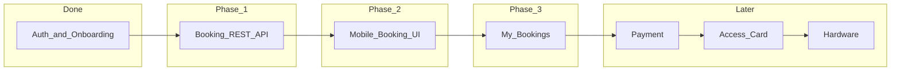

# PlayTT Booking — Phased Implementation

Single source of truth for the booking feature across web and mobile.

## Goal

An onboarded mobile user can **book a slot at PlayTT Hurlingham** and **see it in My Bookings** without payment in v1. Ops can manually confirm `pending` bookings until Phase 4 (M-Pesa).

## Phase map

| Phase | Doc | Status | Deliverable |
|-------|-----|--------|-------------|
| 1 | [phase-1-api.md](./phase-1-api.md) | Implemented | REST API for mobile |
| 2 | [phase-2-mobile-ui.md](./phase-2-mobile-ui.md) | Implemented | Mobile booking flow |
| 3 | [phase-3-my-bookings.md](./phase-3-my-bookings.md) | Implemented | List + detail + home CTA |
| 4 | [phase-4-payment.md](./phase-4-payment.md) | Implemented | M-Pesa / Paystack |
| 5 | [phase-5-access.md](./phase-5-access.md) | Documented | PIN / unlock card |
| 6 | [phase-6-hardware.md](./phase-6-hardware.md) | Documented | TTLock, lighting |

## Shared contracts

See [data-contracts.md](./data-contracts.md) for request/response shapes.

## What already exists

| Layer | Path |
|-------|------|
| Schema | `db/schema.ts` — `bookings`, `payments`, `access_credentials` |
| Seed | `db/seed-phase1.sql` — Hurlingham |
| Domain | `src/server/bookings/` |
| Web UI | `src/components/bookings/`, `src/app/book/page.tsx` |
| Mobile API client | `playtt-mobile/lib/api-client.ts` |

## Testing

Manual checklist: [testing.md](./testing.md)

## Prerequisites

1. `pnpm db:migrate` (onboarding + booking schema)
2. Seed Hurlingham: run `db/seed-phase1.sql`
3. Mobile: `EXPO_PUBLIC_API_URL` points at API host
