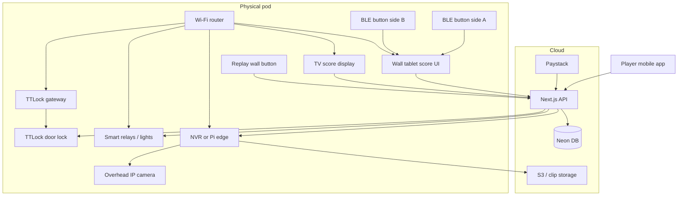

# PlayTT Pod Hardware Guide

Procurement and integration reference for one autonomous table tennis pod. Use this when buying equipment for Hurlingham MVP and future locations.

**Audience:** founders, installers, ops  
**Software alignment:** [`docs/requirements.md`](../requirements.md), [`docs/system_overview.md`](../system_overview.md), [`docs/booking/phase-6-hardware.md`](../booking/phase-6-hardware.md)

---

## How the pod talks to PlayTT



**Rule:** Every device either (a) calls the PlayTT API over the internet, or (b) talks locally to something that does (tablet, NVR, gateway). Credentials live in `hardware_configs` per `location_id`, never in app code.

---

## Bill of materials (one pod)

| # | Item | Qty | Connects to PlayTT via | Phase |
|---|------|-----|------------------------|-------|
| 1 | Smart door lock + gateway | 1 set | TTLock Open API → access PIN / eKey | 5 |
| 2 | Pod Wi‑Fi router | 1 | Stable LAN for all devices | Infra |
| 3 | Smart relays (lights) | 2–4 | Tuya / Shelly / Sonoff cloud or local API | 6 |
| 4 | Wall tablet (score controller) | 1 | Browser → PlayTT scoreboard web UI + WebSocket | 3 |
| 5 | TV or large monitor (score display) | 1 | Browser or cast → same score WebSocket feed | 3 |
| 6 | Bluetooth score buttons | 2 | BLE → tablet app registers +1 | 3 |
| 7 | Overhead IP camera | 1 | RTSP → NVR / edge clipper | 4 |
| 8 | NVR or Raspberry Pi edge | 1 | HTTP webhook → `POST /api/replays/request` + clip upload | 4 |
| 9 | Physical replay button | 1 | HTTP → PlayTT API (debits clip credit) | 4 |
| 10 | UPS (optional) | 1 | Keeps router + gateway alive during brief outages | Infra |

**Not on the table:** PlayTT does **not** put a screen on the table surface. Balls and paddles would damage it. Scoring is via **buttons under the table** + **wall tablet** + **TV**. Players can also score from the **mobile app**.

---

## 1. Door access — smart lock

### What it does
Lets booked players enter during their session only. Code expires at session end (+ 5 min grace).

### How it connects
1. Player pays → booking `confirmed`.
2. PlayTT API calls **TTLock Open API** → creates time-bound PIN or eKey.
3. PIN shown in mobile app (`access_credentials` table).
4. Player enters PIN on lock keypad, or uses TTLock app Bluetooth unlock.

### Recommended

| Tier | Product | Why |
|------|---------|-----|
| **Recommended** | **TTLock** lock + **G2/G3/G4 gateway** | Already in SRS; Open API; widely sold in Kenya/East Africa; gateway gives cloud control when phone is not at door |
| Alternative | TTLock Wi‑Fi lock (no separate gateway) | Simpler install; fewer cables; check API support for your model |

**Models to confirm with supplier:** TTLock models that support **passcode API** and **gateway pairing** (not keyboard-only hotel locks without API).

**Buy:** 1× mortise or rim lock (match your door), 1× gateway per pod (mounted inside, powered, on pod Wi‑Fi).

**Software:** `hardware_configs` provider `ttlock`. See [`phase-5-access.md`](../booking/phase-5-access.md).

---

## 2. Networking — pod Wi‑Fi router

### What it does
Reliable LAN for lock gateway, tablet, TV, camera, NVR, and smart relays. Without this, nothing else is dependable.

### How it connects
Devices use pod Wi‑Fi → internet → PlayTT API (Neon, Paystack, TTLock cloud, etc.).

### Recommended

| Tier | Product | Why |
|------|---------|-----|
| **Budget MVP** | **TP-Link Archer AX55** or **Huawei AX3** | Solid Wi‑Fi 6, easy setup, available in Nairobi |
| **Pro / multi-pod** | **Ubiquiti UniFi** U6-Lite AP + small switch | Cleaner ops, VLANs later, one dashboard |

**Buy:** 1× router/AP per pod room. Use a **guest SSID** for player devices if you want isolation from hardware LAN.

**Install:** Lock gateway, tablet, TV stick, camera, and NVR on **wired Ethernet** where possible; Wi‑Fi only where cables are hard.

---

## 3. Lighting — smart relays

### What it does
- **T−2 min:** room + table lights on (session starting).
- **T−5 min:** warning flash before end.
- **Session end:** table lights off (save power).

### How it connects
PlayTT cron → API → smart home cloud (or local HTTP) → relay toggles circuit.

### Recommended

| Tier | Product | Why |
|------|---------|-----|
| **Best for developers** | **Shelly Plus 1** or **Shelly Pro 4PM** | Local HTTP API, MQTT, no cloud lock-in; easy to test from Next.js |
| **Easiest retail** | **Tuya**-based smart switches (Sonoff, generic) | Common in Kenya; use **Tuya IoT Cloud** API; already in SRS |
| **Electrician-friendly** | **Sonoff MINIR4** | In-wall, Tuya-compatible |

**Buy:** 1 relay for **overhead room lights**, 1 for **table spotlights** (or one 4-channel Pro if circuits are grouped).

**Software:** `hardware_configs` provider `tuya` or `sonoff`. See [`phase-6-hardware.md`](../booking/phase-6-hardware.md).

**Note:** Use proper electrical install (qualified electrician). Relays sit **in line with existing lighting circuits**, not replacing bulbs with Wi‑Fi bulbs (bulbs are unreliable in commercial use).

---

## 4. Wall tablet — score controller

### What it does
Runs the PlayTT **scoreboard web UI** in kiosk mode. Receives Bluetooth button taps, updates score, sends events to API/WebSocket.

This is the **brain** of in-pod scoring—not a consumer “tablet on the table.”

### How it connects
- **Out:** HTTPS + WebSocket to PlayTT API.
- **In:** Bluetooth LE from under-table buttons (paired to tablet).
- **Display:** Large touch targets, dark PlayTT UI ([`physical-brand-appendix.md`](../design-system/physical-brand-appendix.md)).

### Recommended

| Tier | Product | Why |
|------|---------|-----|
| **Recommended** | **Samsung Galaxy Tab A9+** (10.5") or **Lenovo Tab M11** | Good kiosk apps, BLE, long support, easy wall mount |
| **Premium** | **iPad 10th gen** + **Hexnode / Mosyle** kiosk | Rock-solid kiosk; higher cost |
| **Budget** | Refurbished Tab A8 | Acceptable for MVP if mounted securely |

**Buy:** 1× tablet, 1× **VESA or tablet wall mount** (eye level, away from table flight path), 1× **USB-C permanent power** (no battery reliance).

**Software:** Full-screen browser or kiosk app → `https://your-domain.com/pod/scoreboard?resourceId=…` (route to be built in Phase 3). Session tied to active `booking_id`.

---

## 5. TV — live score display

### What it does
Mirrors the score so both players see it while playing—like a stadium board. **Read-only**; no touch required.

### How it connects
Same WebSocket feed as tablet, or a dedicated “display” URL that subscribes to `score_update` events for the active match.

### Recommended

| Tier | Product | Why |
|------|---------|-----|
| **Recommended** | **43–55" commercial display** (Samsung BE43T-H, LG UR series) | Long run hours, no burn-in worries |
| **Budget MVP** | Any TV + **Amazon Fire TV Stick 4K** or **Chromecast with Google TV** | Open score URL in **Silk / Chrome** browser; hide nav bar |
| **Cleanest** | TV with built-in browser app | Fewer HDMI sticks to manage |

**Buy:** 1× TV, mount on wall **behind or beside** table (not facing glare into players’ eyes).

**Do not use:** Consumer “cast only” without a browser unless you build a native receiver app.

---

## 6. Score buttons — under the table (not on the table)

### What it does
Each player taps their side when they win a point. No screen on the table to break.

### How it connects
```
Button (BLE) → Wall tablet (registers +1) → WebSocket → API + TV update
```

### Recommended

| Tier | Product | Why |
|------|---------|-----|
| **Recommended** | **Flic Button 2** (2×, one per end) | Reliable BLE, adhesive mount, long battery, Flic Hub optional but tablet can receive directly on Android |
| **Alternative** | **Logitech POP** buttons | Similar; check Android BLE pairing |
| **DIY / cheapest** | **ESP32 BLE beacon** buttons (custom) | Cheapest at scale; needs firmware dev |

**Buy:** 2× buttons (left/right under table lip), spare batteries, 3M adhesive + screw backup.

**Install:** Mount where a player can tap with knee/hand without leaving the table. Label subtly “Add point” on first visit only (wall sign).

**Fallback:** Mobile app score controls if BLE fails (already in product plan).

---

## 7. Overhead camera — replay capture

### What it does
Records continuous overhead video. When Replay is pressed, last **30 seconds** are clipped and uploaded.

### How it connects
Camera → **RTSP stream** → NVR or Raspberry Pi → clip file → cloud storage → `replays` table → mobile Activity tab.

### Recommended

| Tier | Product | Why |
|------|---------|-----|
| **Recommended** | **Hikvision** dome (e.g. **DS-2CD2147G2-L**) or **Dahua** equivalent | RTSP standard, common in Kenya security market, good WDR for indoor sport |
| **Lens** | **2.8 mm** wide angle for full table view | Mount 3–4 m above table center |
| **Budget** | **Reolink RLC-810A** (PoE) | RTSP, lower cost, verify ceiling mount |

**Buy:** 1× camera, **PoE injector** or PoE switch, ceiling mount.

**Specs:** 1080p minimum, **H.264/H.265**, RTSP URL documented, **PoE** preferred (one cable).

---

## 8. NVR or edge recorder — replay clipping

### What it does
Buffers video 24/7. On replay request, exports last 30s and uploads to S3 (or signals PlayTT worker).

### How it connects
1. `POST /api/replays/request` (from replay button or app) debits clip credit.
2. PlayTT (or edge script) tells NVR to export segment **or** Pi pulls RTSP buffer.
3. `POST /api/replays/[id]/ready` with `videoUrl` when upload completes.

The ready callback requires `x-playtt-replay-secret` matching the configured
non-blank `REPLAY_WEBHOOK_SECRET`. Missing server configuration returns 503 for
retry; missing/invalid caller credentials return a generic 401. Payloads accept
only HTTPS media URLs without embedded credentials (maximum 2,048 characters)
and an optional trimmed title (maximum 160 characters). Never place the secret
in the URL, payload, or logs.

### Recommended

| Tier | Product | Why |
|------|---------|-----|
| **Best API path** | **Hikvision NVR** (e.g. **DS-7604NI-K1/4P**) + same-brand camera | ISAPI export; PoE ports; one vendor stack |
| **Developer-friendly** | **Raspberry Pi 5** + **Frigate** or **custom FFmpeg** buffer | Full control; matches `nvr-worker.ts` stub; good for MVP if you have dev time |
| **Avoid for MVP** | Cloud-only cameras (Ring, Nest) | No RTSP / no reliable 30s clip API |

**Buy:** 1× NVR **or** 1× Pi 5 (8 GB) with 256 GB+ SSD, on wired Ethernet.

**Software:** `hardware_configs` provider `camera_nvr`. Env:
`REPLAY_WEBHOOK_SECRET`; `NVR_STUB_AUTO=true` is development/test-only.
Production ignores the auto-run flag, and direct stub execution throws before
any replay row can be marked ready or a `https://playtt.local/...` placeholder
URL can be published. A production replay request remains pending for the real
NVR/edge workflow.

---

## 9. Replay button — wall mounted

### What it does
Physical “capture that rally” control. Debounces spam; requires **clip credits** (see [`coach-and-replays.md`](../../playtt-mobile/docs/design-system/coach-and-replays.md)).

### How it connects
Button press → HTTP POST to PlayTT `POST /api/replays/request` with `bookingId` → credit debit → NVR clip job.

### Recommended

| Tier | Product | Why |
|------|---------|-----|
| **Recommended** | **Shelly Button 1** or **Shelly i4** (scene to webhook) | HTTP webhook to your API; no custom PCB |
| **Alternative** | **Flic Button** (second function: long-press = replay) | If you already use Flic for scoring |
| **Pro** | **ESP32 + momentary wall plate** | Custom URL + LED feedback (“clipping…”) |

**Buy:** 1× button near table, visible, away from accidental hits.

**UX:** Pod display or tablet shows “Clipping your highlight…” / “You need clip credits” (calm copy, no alarm).

---

## 10. Power and mounting (often forgotten)

| Item | Notes |
|------|--------|
| **UPS** | Small line-interactive UPS for router + gateway + NVR (≈15 min) |
| **Cable management** | Trunking along walls; no loose HDMI across walk paths |
| **PoE switch** | If camera + AP need PoE, one **8-port PoE switch** simplifies install |
| **Kiosk lock** | Tablet: guided access / kiosk mode so players cannot exit score app |
| **Signage** | Minimal “Tap under table to score” + “Replay button” per brand appendix |

---

## Integration priority (buy in this order)

| Order | Buy | Why first |
|-------|-----|-----------|
| 1 | Router + electrician rough-in | Everything depends on network |
| 2 | TTLock + gateway | Unmanned entry is core product |
| 3 | Shelly/Tuya relays + lights | Session automation + safety |
| 4 | Tablet + 2× BLE score buttons | Playable scoring without TV |
| 5 | TV | Better experience, not blocking |
| 6 | Camera + NVR/Pi + replay button | Clips + Coach pipeline |

Phases 1–4 software (booking, pay, app) can ship **before** items 6–7.

---

## Kenya procurement tips

- **TTLock / Hikvision / Dahua:** Security suppliers on Mombasa Rd, Westlands, and Industrial Area often stock or order within 1–2 weeks. Ask for **API-compatible** models, not consumer-only retail locks.
- **Shelly:** Order via official EU store or local Amazon/Jumia; verify voltage **230 V** variants.
- **Tablets:** Samsung/Lenovo from Carrefour, Faiba, or authorized resellers; buy **Wi‑Fi only** (no SIM needed).
- **Electrician:** Smart relays must be installed in **distribution board or ceiling rose**, not DIY inline for mains.

---

## What not to buy

| Avoid | Why |
|-------|-----|
| Wi‑Fi bulbs only | Fail in commercial hours; hard to group “table lights” |
| Consumer smart locks without API | No PIN automation from PlayTT |
| Ring / Nest cameras | Weak RTSP / clip export for custom backend |
| Tablet lying on table | Damage, glare, cable hazard |
| Proprietary “sports scoring” systems | Won’t integrate with PlayTT bookings/replays/Coach |
| Separate apps per device | Ops nightmare; prefer one API layer |

---

## Checklist before install day

- [ ] Pod Wi‑Fi online; static IP or DHCP reservation for NVR, gateway, tablet
- [ ] TTLock gateway paired; test PIN from API in staging
- [ ] Relay circuits labeled (room vs table)
- [ ] Tablet kiosk URL loads scoreboard for test `booking_id`
- [ ] TV shows same score as tablet on test tap
- [ ] Both BLE buttons register on tablet
- [ ] Camera RTSP URL viewable on laptop on pod LAN
- [ ] Replay button hits staging API; credit debit works
- [ ] All secrets in `hardware_configs` for `location_id`, not in repo

---

## Related docs

- [`docs/requirements.md`](../requirements.md) — REQ-4.x, REQ-5.x hardware requirements
- [`docs/system_overview.md`](../system_overview.md) — Magic loop data flow
- [`docs/booking/phase-5-access.md`](../booking/phase-5-access.md) — TTLock integration
- [`docs/booking/phase-6-hardware.md`](../booking/phase-6-hardware.md) — Lighting cron
- [`playtt-mobile/docs/design-system/coach-and-replays.md`](../../playtt-mobile/docs/design-system/coach-and-replays.md) — Clip credits + replays
- [`docs/design-system/physical-brand-appendix.md`](../design-system/physical-brand-appendix.md) — Mount and finish rules
