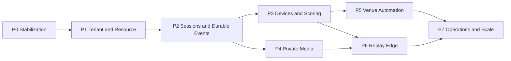

# PlayTT Platform Delivery Phases

## Purpose

This is the release roadmap for the [PlayTT Platform Implementation Blueprint](./implementation.md). Each phase is an independently deployable increment with explicit prerequisites, outputs, tests, rollout controls, and rollback behavior. A phase is not complete because its code was merged; all exit gates must pass and evidence must be recorded.

Detailed implementation and verification steps are in [phase-build-and-test.md](./phase-build-and-test.md).
Day-to-day feature tracking and completion checkboxes are in the [master build checklist](./master-build-checklist.md).

## Delivery rules

- Complete phases in dependency order. Phase 4 may overlap the final part of Phase 3 after Phase 2 contracts are stable.
- Keep existing web/mobile booking, authentication, payment, and modification contracts working throughout.
- Use additive migrations, feature flags, and compatibility adapters. Do not combine expansion and destructive contraction in one release.
- Every schema phase must pass both fresh-database and current-production-clone migration tests.
- Every write endpoint must define authentication, authorization, validation, concurrency, idempotency, audit, and failure behavior.
- Hardware, provider, worker, Redis, R2, and venue-edge failure must degrade safely without corrupting booking/payment truth.

## Dependency map

## Phase status register

| Phase | Outcome | Hard dependency | Production feature default | Current status |
| --- | --- | --- | --- | --- |
| 0 | Trustworthy current baseline | None | Existing behavior only | **Complete** — repository, hosted CI, live fingerprints, staging provider callbacks, and device smoke evidence recorded |
| 1 | Tenant-aware venue/resource core | Phase 0 | New tenant features off | Ready to start |
| 2 | Durable payment and play-session orchestration | Phase 1 | Worker consumers staged then enabled | Not started |
| 3 | Provisioned devices and authoritative scoring | Phase 2 | Per-resource device/scoring flags off | Not started |
| 4 | Private media metadata and R2 grants | Phase 2 | R2 media off outside internal cohort | Not started |
| 5 | TTLock booking codes and relay automation | Phases 2 and 3 | Per-venue/provider flags off | Not started |
| 6 | Venue-edge replay capture | Phases 3 and 4 | Per-resource replay flag off | Not started |
| 7 | Operational and scale certification | Phases 5 and 6 | Progressive venue rollout | Not started |

## Phase 0 - Stabilization and safety net

### Objective

Create a verified baseline that protects the working product and removes known correctness, security, migration, and delivery blockers.

### Work packages

| Ticket | Deliverable | Definition of done | Local status |
| --- | --- | --- | --- |
| P0-01 | Current architecture and contract inventory | Mobile API v1 and web Server Action contracts are fixture-backed; unknown booking/payment/replay status handling is documented and tested. | **Done** |
| P0-02 | Drizzle lineage repair | Migrations `0000`-`0005`, snapshots, journal, custom GiST exclusion, and partial unique indexes replay cleanly; live `__drizzle_migrations` fingerprints and cloned-current reconciliation are complete. | **Done** |
| P0-03 | Booking authorization repair | Server Action derives the current user from the session, enforces onboarding, and cannot create holds for another user. Existing action response shape remains stable. | **Done** |
| P0-04 | Concurrency and idempotency fixes | Same-slot creation, payment confirmation, expiry, cancellation, and modification credit races have deterministic database-backed outcomes; durable logical identities protect history, ledgers, and confirmation email. | **Done** |
| P0-05 | Paystack and cron hardening | Invalid signatures are rejected; durable processing failures return a retryable non-2xx until the inbox is active; production cron fails closed without a secret; staging Paystack and replay-ready callbacks verified. | **Done** |
| P0-06 | Automated quality baseline | `node:test`, Playwright, mobile Jest/RNTL, lint/typecheck/build scripts, seeded test database, and GitHub Actions (`migration-empty`, `web-build-e2e`, `mobile-test`, `quality-gate`, `secret-scan`) pass in hosted CI. | **Done** |
| P0-07 | Existing lint/build cleanup | Blocking web/mobile lint errors are fixed and production builds run against an isolated seeded environment. | **Done** |

### Exit gate

All Phase 0 exit gates have passed with linked evidence:

- Empty and representative current DB migrate and seed successfully twice with ledger reconciliation.
- Hosted GitHub Actions `quality-gate` passes on the target branch.
- Staging Paystack delivers a valid event to a deployed preview and confirms one booking.
- Replay-ready callback passes with a staging edge/NVR client.
- Android/iOS preview device smoke passes.
- Auth, hosted checkout return, modification, booking hold/cancel, and account journeys pass in deployed environments.
- Concurrent same-slot requests yield exactly one hold; adjacent ranges both succeed under hosted PostgreSQL concurrency.
- Duplicate valid webhook is harmless; invalid signature does not mutate state; processing failure is retryable in staging.
- Cross-user Server Action and ownership tests pass in hosted CI.
- Web and mobile lint/typecheck/build gates pass.
- No new platform schema or feature is enabled yet.

**Outstanding:** Phase owner and reviewer sign-off before Phase 1 schema work begins.

### Rollback

No destructive DDL is allowed. Application fixes are independently revertible; repaired migration metadata is only accepted after environment fingerprint equivalence is proven.

**Live-migrate freeze lifted:** live environments were fingerprinted, classified, and reconciled. Future migrations still require empty/current-clone proof before production rollout.

## Phase 1 - Tenant and resource foundation

### Objective

Turn the existing single-operator model into a tenant-aware catalog without changing existing IDs or customer behavior.

### Work packages

| Ticket | Deliverable | Definition of done |
| --- | --- | --- |
| P1-01 | Tenant/brand foundation | `tenants`, `tenant_memberships`, and optional `brands` exist; deterministic PlayTT records are seeded. **Local evidence (2026-08-17):** migration `0006_tenancy_foundation`, `db/seed-phase1.sql` backfill, `src/server/tenancy/` resolver/permissions, `pnpm test:tenancy` and `pnpm db:validate:strict` pass. |
| P1-02 | Venue evolution | Existing `locations` gain tenant/brand/settings/archive scope and are exposed as venues at domain/API boundaries without a physical-table rename. **Local evidence (2026-08-17):** migration `0007_venue_resource_catalog`, Hurlingham backfill in `db/seed-phase1.sql`, `src/server/catalog/` venue mapper, `pnpm test:catalog` passes. |
| P1-03 | Resource catalog | Add zones, resource types, resource capabilities, ruleset/configuration, human codes, and tenant-leading constraints; map the current pod to `table_tennis_table`. **Local evidence (2026-08-17):** `zones`, `resource_types`, `resource_capabilities` tables; Main Hall / `Table 01` / `tt_standard_v1` seeded; legacy `pod` enum retained. |
| P1-04 | Tenant backfill | All tenant-owned commercial, operational, Coach, replay, and notification rows are backfilled through authoritative parent relationships. **Local evidence (2026-08-17):** migrations `0008_tenant_scope_expand` and `0009_tenant_scope_enforce`, `db/backfill-tenant-scope.sql`, `feature_flags`/`audit_logs`, NOT VALID composite FKs, `scripts/validate-tenant-backfill.mjs`, `pnpm test:tenant-backfill` passes. |
| P1-05 | TenantContext and RBAC | Membership-derived context, action permissions, tenant-scoped repositories, audit records, and negative cross-tenant tests cover all tenant-owned paths. **Local evidence (2026-08-17):** `src/server/tenancy/` runtime (`authorize`, `requireTenantContext`, public/service context factories, `writeAuditLog`, HTTP mapping); tenant filters on bookings/modifications/payments/coach/replays repositories; request wiring on booking/coach/replay routes and server actions; `pnpm test:tenancy` and `pnpm test:tenant-rbac` pass. |
| P1-06 | Operator shell | Authorized operators can inspect tenant, venue, zone, resource, capability, and membership configuration. |
| P1-07 | Legacy compatibility | Existing endpoints resolve the PlayTT tenant server-side; released mobile and web clients require no tenant payload changes. |
| P1-08 | Access-point catalog | Tenant/venue/zone access points and resource-to-door requirements support shared entrances and multiple controlled doors without hard-coded lock IDs. |

### Exit gate

- Zero null tenant IDs, tenant/parent mismatches, orphaned rows, or unvalidated tenant constraints.
- Tenant A cannot read/write Tenant B resources, bookings, payments, sessions, devices, or media by guessed ID.
- Both tenants may use the same venue/resource human code without conflict.
- Current Hurlingham/Table 01 booking and payment flow is unchanged.
- Old mobile contract fixtures pass against the tenant-aware backend.
- New tenant/resource APIs remain feature-flagged until the gate passes.
- Hurlingham and a second venue can model shared entrances and resource-specific doors without provider IDs in booking logic.

### Rollback

Switch reads and tenant features off; additive tables/columns remain. Contract removal or physical renaming is deferred to a later approved release.

## Phase 2 - Payment hardening, operational sessions, and durable events

### Objective

Make payment confirmation and venue session orchestration durable, idempotent, recoverable, and observable.

### Work packages

| Ticket | Deliverable | Definition of done |
| --- | --- | --- |
| P2-01 | Paystack webhook inbox | Verified raw events are durably stored by unique provider identity before acknowledgement; invalid signatures never enter processing. |
| P2-02 | Transactional outbox and worker | Versioned events, leases/claims, retry/backoff, dead-letter state, correlation, and consumer idempotency survive restart. |
| P2-03 | Operational `play_sessions` | One session per confirmed booking, participants, configuration snapshot, timestamps, and validated state transitions are implemented. |
| P2-04 | Atomic confirmation | Payment, booking, history, play session, and outbox events commit exactly once in one transaction. |
| P2-05 | Durable lifecycle scheduler | Prepare, start, ending, complete, and reset work is scheduled and periodically reconciled without in-memory timers. |
| P2-06 | Side-effect migration | Confirmation email and later consumers move behind outbox only after their consumers are deployed and idempotent. |
| P2-07 | Compatibility projections | Existing booking/payment API shapes and callback polling continue to work while session fields are added. |

### Exit gate

- Concurrent duplicate/reordered webhook delivery causes one logical payment transition, booking confirmation, session, history entry, and notification.
- A crash after inbox/outbox commit recovers automatically.
- Illegal session transitions are rejected and audited.
- Missed lifecycle work is recreated by reconciliation.
- Callback verification still resolves delayed webhook delivery.
- Worker backlog, attempts, errors, and dead letters are visible.

### Rollback

Disable consumers and new session projections while retaining inbox/outbox data. Keep the previous customer contract and never delete committed workflow records.

## Phase 3 - Device registry, ESP32 scoring, and realtime

### Objective

Provision and operate assignable venue devices while making the backend the authoritative source of score and live session state.

### Work packages

| Ticket | Deliverable | Definition of done |
| --- | --- | --- |
| P3-01 | Device registry and enrollment | Devices, short-lived one-time enrollment, hashed/rotatable credentials, revocation, and capabilities are implemented. |
| P3-02 | Assignments and configuration | Time-aware device-to-resource roles, configuration versions, and per-resource capability checks support reassignment without reflashing. |
| P3-03 | Heartbeat and fleet health | HTTPS heartbeat records latest health and sampled history; configurable offline detection is resource-isolated. |
| P3-04 | Device commands and acknowledgements | Expiring commands, retries, acknowledgement state, correlation, and audit are implemented behind `DeviceCommandBus`. |
| P3-05 | Immutable scoring | Device event idempotency, score events, snapshots, corrections, and active-session authorization are transactional. |
| P3-06 | Sport rules adapter | `tt_standard_v1` is configuration-backed and isolated from generic session/booking logic. |
| P3-07 | Realtime projections | Provider-neutral broadcaster, scoped channels, kiosk screen, and TV display reconcile against server snapshots. |
| P3-08 | ESP32 deliverable | Firmware contract, simulator, offline buffer, debounce, boot/sequence identity, heartbeat, config, command acknowledgement, and signed-OTA plan are verified. |

### Exit gate

- Revoked, expired, wrong-tenant, wrong-assignment, and inactive-session device requests are rejected.
- Duplicate/retried inputs never double-score; ordering/version gaps reconcile safely.
- Score event, snapshot, and outbox update atomically.
- Two displays converge after missed messages or reconnect.
- Redis outage does not lose scores or stop HTTP ingestion.
- Table 04 device failure or events cannot affect Table 05.
- Simulator and one physical ESP32 pass the same protocol suite.

### Rollback

Disable device/scoring/realtime flags per tenant, venue, or resource. Booking/payment/session operation remains available without the live scoring feature.

## Phase 4 - Private R2 media foundation

### Objective

Create secure, tenant-authorized media storage without exposing cloud credentials or replacing working replay entitlement APIs.

### Work packages

| Ticket | Deliverable | Definition of done |
| --- | --- | --- |
| P4-01 | Media metadata | `media_assets` owns tenant/venue/resource/session/user scope, immutable object key, type, size, checksum, retention, and state. |
| P4-02 | MediaStore and R2 adapter | Private dev/staging/prod buckets and exact-object operations are isolated behind a tested port. |
| P4-03 | Authorized grants | Short-lived PUT/GET grants require database ownership and exact key, operation, content policy, and expiry. |
| P4-04 | Upload completion | Callback or R2 event transitions metadata idempotently and can trigger processing. |
| P4-05 | Existing replay compatibility | Current `replays` gain optional media linkage; legacy URLs remain explicit legacy assets until migrated and verified. |
| P4-06 | Security configuration | Public access is disabled; scoped tokens, exact CORS, lifecycle, retention, deletion, and reconciliation are documented and reproducible. |

### Exit gate

- Guessed media IDs/object keys cannot cross user or tenant boundaries.
- No R2 secret appears in browser, mobile, firmware, API JSON, or logs.
- Duplicate upload completion is harmless.
- R2 outage leaves retryable metadata rather than false ready state.
- Existing replay credit and library contracts continue to pass.
- DB-to-R2 reconciliation detects missing, unexpected, or deletion-pending objects.

### Rollback

Disable R2-backed grants and retain metadata. Development may return to a clearly labeled stub; production must never expose the fake public replay URL.

## Phase 5 - TTLock access and venue automation

### Objective

Provision booking-specific TTLock keypad codes across the correct doors at each venue, then drive access and environmental actions from operational sessions through recoverable provider adapters.

### Work packages

| Ticket | Deliverable | Definition of done |
| --- | --- | --- |
| P5-01 | AccessProvider contract | Simulator and provider-neutral access contract cover provision, modify, revoke, reconcile, and credential status. |
| P5-02 | TTLock connection and inventory | Server-only tenant TTLock connections sync gateways/locks, validate custom-passcode support, and assign each lock to a configured access point. |
| P5-03 | Booking code provisioning | Paid confirmation resolves every required door and creates one secure booking-specific timed code across all assigned TTLocks through their gateways. |
| P5-04 | Code lifecycle and reconciliation | Cancellation, reschedule, resource/venue change, expiry, partial failure, token expiry, gateway outage, and provider drift reconcile idempotently. |
| P5-05 | Mobile access experience | Preview PINs are replaced by authorized live code/status behind `liveAccess`; validity and door list are clear and pending/cancelled bookings never reveal access. |
| P5-06 | TTLock operator tools | Operators can commission connections/gateways/locks, monitor battery/clock/health, retry/revoke, inspect redacted unlock records, and perform restricted audited remote unlock. |
| P5-07 | RelayProvider | Simulator plus first relay adapter performs configured prepare/warn/end/reset actions independently of TTLock success. |
| P5-08 | Notifications | Push permission, token registration, access-ready/session reminders, warning/end events, and polling fallback are implemented. |

### Exit gate

- Every paid booking receives one individual code only after all required venue/resource doors have accepted it.
- The same code works across the booking's required TTLock-controlled doors; unrelated venue/resource locks reject it.
- Access validity matches configured early-entry and end/grace windows and lock clock/timezone state.
- Duplicate provision/modify/revoke/relay commands and acknowledgements are harmless.
- Expired/replayed commands are rejected.
- TTLock token expiry, rate limiting, unsupported lock, low battery, clock skew, gateway offline, partial multi-door provisioning, and provider outage do not fail or reverse payment/booking/session confirmation; they create visible recoverable access state.
- Mobile refreshes stale credentials and safely handles offline/expired state.
- Manual operations are permission-checked and fully audited.

### Rollback

Disable providers/commands per venue/resource and use documented manual procedures. Preserve sessions and pending automation records for later reconciliation.

## Phase 6 - Replay edge pipeline

### Objective

Replace the production NVR stub with a vendor-neutral, private, idempotent replay workflow running primarily on the venue LAN.

### Work packages

| Ticket | Deliverable | Definition of done |
| --- | --- | --- |
| P6-01 | Replay requests | Authorized active-session requests create one durable request, correlation ID, media identity, and edge command. |
| P6-02 | VideoAdapter and edge protocol | Source selection, buffer window, extraction, upload request, status, retry, and acknowledgement are vendor-neutral. |
| P6-03 | Prototype edge | One-table rolling buffer extracts a valid clip and uploads directly using the Phase 4 grant. |
| P6-04 | Resource/camera configuration | Device assignments and capabilities select cameras for ten resources without hard-coded IPs or code forks. |
| P6-05 | Playback and activity | Ready media appears through existing authenticated replay/activity APIs with short-lived playback access. |
| P6-06 | Failure recovery | Edge disconnect, upload retry, duplicate callback, missing source, and partial processing are visible and resumable. |

### Exit gate

- Replay is restricted to an entitled user/device and active session/resource.
- Duplicate request or edge retry produces one logical request and one media object.
- Wrong-tenant/resource/camera requests are rejected.
- Offline edge resumes with the same request, media ID, and object key.
- Ten configured resources select the correct cameras without cross-talk.
- Edge/R2 failure never blocks session completion or booking/payment.

### Rollback

Disable replay capture per venue/resource while preserving pending requests for retry or explicit cancellation. Development stub remains development-only.

## Phase 7 - Operations and scale certification

### Objective

Prove the platform can be operated safely as an autonomous multi-table, multi-venue service.

### Work packages

| Ticket | Deliverable | Definition of done |
| --- | --- | --- |
| P7-01 | Operations dashboard | Tenant/venue/resource health, sessions, devices, TTLock connections/gateways/locks/codes, commands, payments, workers, media, and incidents are remotely diagnosable. |
| P7-02 | Alerts and runbooks | Device offline, webhook failure, session stuck, worker backlog, automation failure, replay backlog, and infrastructure alerts link to recovery procedures. |
| P7-03 | Environment and DR | Preview/staging/production isolation, backup/restore, secret rotation, migration rehearsal, and incident recovery are proven. |
| P7-04 | Venue network certification | Managed VLAN/firewall policy separates management, cameras, IoT, displays, staff, and guest traffic; camera recording remains local. |
| P7-05 | Ten-table certification | Concurrent resources, device isolation, realtime scoping, camera selection, and failure containment pass under expected load. |
| P7-06 | Multi-tenant certification | Cross-tenant denial, duplicate human codes, configurable branding/rules/retention, and a second resource type pass without core booking changes. |
| P7-07 | Production rollout | Internal, preview, pilot venue, progressive resource, and general-availability gates have owners, metrics, rollback, and sign-off evidence. |

### Exit gate

- Single-table, ten-table, and multi-tenant acceptance suites pass.
- Operators can locate and recover a failed device/resource workflow remotely.
- Backup restore, secret rotation, worker restart, Redis outage, R2 outage, and selected venue WAN outage exercises pass.
- Production feature flags, alert ownership, escalation, and rollback are documented and tested.
- No public bucket, shared production/non-production credential, client secret exposure, or cross-tenant access remains.

### Rollback

Roll back by feature cohort, venue, resource, or provider. Maintain a known-good booking/payment-only operating mode and documented manual venue fallback.

## Program completion

The program is complete only when all Phase 7 gates pass and the evidence is linked from the phase playbook. Future extraction into separate realtime, device broker, media processing, or analytics services requires measured scale or organizational need; it is not part of this roadmap.
