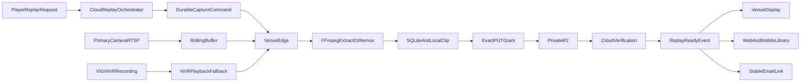

# Replay Edge Pipeline

Canonical engineering specification for Phase 6 — venue-local replay capture, direct private R2 upload, and authorized playback.

## Overview

PlayTT replays are short session clips captured on the venue LAN, uploaded directly to private Cloudflare R2 using Phase 4 exact-object grants, and delivered through authenticated playback surfaces (scoreboard, web/mobile library, email links).

Continuous RTSP/video never enters the cloud application. Only the single requested clip uploads per replay request.

## Architecture

- **One TypeScript VenueEdge service per venue** at `services/venue-edge/` — independent package, not a Next.js process.
- **One primary replay stream per resource** initially; the NVR continues recording all cameras for security.
- **Hybrid capture:** 60–120 second edge rolling buffer is the fast path; time-bounded VIGI NVR playback is fallback only after pilot hardware validation.
- **Default replay window:** configurable `12s` pre-roll + `3s` post-roll (15 seconds total).
- **FFmpeg:** remux with stream copy when source is browser-compatible H.264 MP4; transcoding is explicit compatibility fallback.
- **One logical clip** serves scoreboard, web/mobile library, and email-linked playback.



## Trigger policy

1. **Authenticated app request** is the first capture trigger (`POST /api/v1/sessions/:sessionId/replay-requests` with required idempotency key).
2. **Physical table button** is added only after device identity is bound to active session and owner/credit policy; it never impersonates a user session.
3. Legacy `POST /api/replays/request` remains as compatibility adapter delegating to the new orchestration.

## Immutable identities

These never change across retries:

| Identity               | Purpose                         |
| ---------------------- | ------------------------------- |
| `replayRequestId`      | Durable request lifecycle row   |
| `replayId`             | Player-facing replay projection |
| `mediaAssetId`         | Phase 4 media metadata          |
| `objectKey`            | R2 object path                  |
| `correlationId`        | Cross-service tracing           |
| `clientIdempotencyKey` | Duplicate API deduplication     |

Duplicate button/API requests return the same logical replay and debit one credit.

## Replay request state machine

### Happy path

`requested → authorized → dispatched → edge_acknowledged → capturing → extracting → uploading → verifying → ready`

### Terminal / retryable failures

| Status              | Retryable | Meaning                                                |
| ------------------- | --------- | ------------------------------------------------------ |
| `edge_offline`      | Yes       | VenueEdge not reachable; command queued for redelivery |
| `buffer_missing`    | Yes       | Rolling buffer did not cover capture window            |
| `extraction_failed` | Yes       | FFmpeg extraction/remux failed                         |
| `upload_failed`     | Yes       | R2 PUT or grant renewal failed                         |
| `expired`           | No        | Command or grant TTL exceeded                          |
| `failed`            | No        | Unrecoverable terminal failure                         |

State transitions are explicit in code; no implicit status mutation.

## Cloud / edge protocol (v1)

Reuses Phase 3 device enrollment, hashed credentials, heartbeat, expiring command delivery, ACK, and retry infrastructure.

### Edge endpoints (device-authenticated)

| Endpoint                                         | Purpose                                        |
| ------------------------------------------------ | ---------------------------------------------- |
| `GET /api/edge/v1/config`                        | Authorized venue/resource/camera configuration |
| `POST /api/edge/v1/heartbeat`                    | Health + command poll                          |
| `GET /api/edge/v1/commands`                      | Expiring command delivery                      |
| `POST /api/edge/v1/commands/:id/ack`             | ACK/progress/failure                           |
| `POST /api/edge/v1/media/:mediaId/upload-url`    | Exact PUT grant renewal                        |
| `POST /api/edge/v1/replay-requests/:id/progress` | Structured progress updates                    |

### `capture_replay` command payload

```json
{
  "replayRequestId": "uuid",
  "replayId": "uuid",
  "mediaAssetId": "uuid",
  "objectKey": "tenant/.../media.mp4",
  "captureAt": "2026-08-21T20:00:00.000Z",
  "preRollSeconds": 12,
  "postRollSeconds": 3,
  "sourceType": "edge_buffer",
  "resourceId": "uuid",
  "playSessionId": "uuid",
  "configRevisionId": "uuid",
  "uploadGrant": { "url": "...", "expiresAt": "..." }
}
```

`configRevisionId` is copied from the replay request's immutable published and
device-applied VenueEdge configuration revision. Retries preserve the same value; the edge
rejects a command when it does not match an available authorized revision.

Camera/NVR credentials remain on the venue PC in OS-protected storage. Cloud
config contains only an opaque local lookup key; credentials and authenticated
RTSP URLs never appear in cloud payloads, fixtures, ordinary logs, or backfill
reports.

## VenueEdge local storage

### SQLite tables

- `edge_commands` — persisted command queue and progress
- `edge_replay_jobs` — replay extraction/upload state
- `edge_buffer_segments` — rolling buffer segment metadata

### Filesystem layout

```
{dataDir}/
  buffers/{cameraId}/     # rolling segments (bounded disk)
  pending/{replayRequestId}/  # extracted clips awaiting upload
  uploaded/               # verified uploads pending cloud ACK
  failed/                 # terminal failures with reason
```

### Cleanup rules

- Buffer segments: retain 60–120 seconds; delete oldest when disk budget exceeded.
- Pending clips: retain until cloud verification marks media ready or terminal failure.
- Failed clips: retain 24h for diagnostics then purge.

## Security boundaries

| Actor        | R2 credentials             | Camera/NVR credentials                    | Replay trigger                     |
| ------------ | -------------------------- | ----------------------------------------- | ---------------------------------- |
| Cloud API    | Issues short-lived grants  | None; stores only opaque local references | Authorizes requests                |
| VenueEdge    | Uses exact PUT grants only | OS-protected local store                  | Executes capture                   |
| Web/mobile   | Playback GET grants only   | None                                      | App-authenticated request          |
| ESP32/button | None                       | None                                      | Device-authenticated after binding |
| Display      | Playback GET grants only   | None                                      | Read-only playback                 |

## Feature flags

| Flag            | Scope                 | Default                          |
| --------------- | --------------------- | -------------------------------- |
| `private_media` | Tenant                | Required for R2 grants (Phase 4) |
| `replay_edge`   | Tenant/venue/resource | Off until gate passes            |

## Target SLOs (initial measured targets)

| Metric           | Target       |
| ---------------- | ------------ |
| Replay-ready p50 | < 7 seconds  |
| Replay-ready p95 | < 15 seconds |

Measured from authorized request to `replay.ready.v1` emission after R2 verification.

## Observability

- Structured audit events for request, dispatch, progress, ready, and failure.
- Correlation ID propagated cloud → edge → media completion.
- Edge health: buffer age, disk usage, FFmpeg process state, upload queue depth.
- Operations: explicit failure reason on every terminal state.

## VIGI NVR pilot checklist

Before implementing `VigiNvrPlaybackAdapter`, validate on pilot hardware. **Step-by-step walkthrough (NVR + cameras + monitor already set up):** [vigi-nvr-pilot-walkthrough.md](../hardware/vigi-nvr-pilot-walkthrough.md). Checklist + automated probe: [vigi-nvr-pilot-checklist.md](../hardware/vigi-nvr-pilot-checklist.md) · `pnpm probe:vigi`

- [ ] Exact VIGI model and firmware version
- [ ] Live RTSP URL syntax and authentication
- [ ] Playback URL/time semantics for time-bounded extraction
- [ ] Codec (H.264 compatibility)
- [ ] Clock sync between edge, camera, and NVR
- [ ] Credential rotation and network isolation

## Rollback

- Disable `replay_edge` per tenant/venue/resource.
- Preserve pending requests for retry or explicit cancellation.
- Development NVR stub remains development-only (`NVR_STUB_AUTO`, `playtt.local` URLs blocked in production).
- Follow the [VenueEdge v2 rollback procedure](../security/venue-edge-threat-model.md#v2-rollback-procedure); never copy local NVR credentials back into v1 cloud JSON.

## Staged acceptance gates

| Stage | Gate                                                              |
| ----- | ----------------------------------------------------------------- |
| 0     | Architecture review; no unresolved state/secret/retry assumptions |
| 1     | Duplicate request debits once; migration tests pass               |
| 2     | Protocol fixtures frozen; simulator passes without secrets in API |
| 3     | One-table 15s clip, direct R2 upload, restart recovery            |
| 4     | Scoreboard/library/email playback with authorization              |
| 5     | Two-resource isolation; NVR fallback validated                    |
| 6     | Ten-resource capacity measured; recovery tools operational        |

## Related documents

- [Private R2 media (Phase 4)](./r2-security.md)
- [Delivery phases](./phases.md)
- [Build and test playbook](./phase-build-and-test.md)
- [Master build checklist](./master-build-checklist.md)
