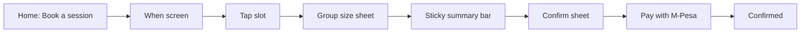

# Mobile Booking UX

Canonical guide for PlayTT mobile booking decisions. When changing the booking flow, read this first.

## Goal

A returning player should book in **about 3 taps**:

1. Open booking
2. Tap a time slot
3. Confirm players and book

First-time users get the same path with light guidance (progress dots, plain copy).

## Flow

## Tap budget

| User | Target taps after opening Book |
|------|-------------------------------|
| Returning, single venue | 3 (slot → continue players → book) |
| First-time | 3–4 (same, may read progress dots) |
| Multi-venue (future) | +1 only if user changes venue |

## Defaults

| Choice | Default | When user chooses |
|--------|---------|-------------------|
| Venue | Only location (Hurlingham) | Multi-venue: venue chip → picker sheet |
| Date | Today | Date chips (Today, Tomorrow, weekday) |
| Duration | 60 min | 30 / 60 toggle |
| Players | 2 | Group size sheet after slot tap |
| Notes | Hidden | "Add a note (optional)" on confirm sheet |

## Component map

| File | Responsibility |
|------|----------------|
| `components/booking/booking-flow.tsx` | State, API calls, step routing |
| `components/booking/timing-panel.tsx` | Pinned filters + scrollable slot list, empty state |
| `components/booking/group-size-sheet.tsx` | Player count after slot selection |
| `components/booking/booking-checkout-bar.tsx` | Sticky summary + "Book this slot" |
| `components/booking/booking-confirm-sheet.tsx` | Final review, notes, submit |
| `components/booking/booking-payment-step.tsx` | Pay step (M-Pesa or card) after hold created |
| `components/booking/payment-method-picker.tsx` | M-Pesa / Card selector |
| `components/booking/booking-detail-payment-actions.tsx` | Pay now CTA on booking detail |
| `components/booking/booking-progress.tsx` | When → Players → Done dots |
| `components/ui/bottom-sheet.tsx` | Shared sheet primitive |

## Theming

Booking uses `useProductTheme()` from [`hooks/use-product-theme.ts`](../../hooks/use-product-theme.ts). It follows the device color scheme:

| Mode | Surfaces |
|------|----------|
| Light | `productBackground`, white cards, dark text |
| Dark | App dark tokens (`background`, `card`, `foreground`) |

Do not hardcode `PlayTTColors.product*` in booking components. Pass `productTheme` to `Button` when `surface="product"`.

## Decision rules

### Sheets vs full screens

- **Use bottom sheets** for group size and final confirm. They keep context visible and reduce steps.
- **Use full screens** only for the main timing list and confirmation success.
- **Never** use a full-page checkout step when a sheet can hold the summary.

### When to skip steps

- **Single venue:** auto-select and skip venue step. Show venue as a chip on the timing screen.
- **Multi-venue (future):** venue chip opens a picker sheet; do not add a dedicated wizard step unless there are 3+ venues.

### Timing layout

- Pin venue chip, date strip, and duration toggle at the top.
- Only the **Available times** list scrolls (`flex: 1` slot `ScrollView`).
- Do not wrap the whole timing screen in an outer scroll view.

### One primary action per moment

- Timing screen: pick a slot (no Continue button).
- Group sheet: Continue.
- Sticky bar: Book this slot.
- Confirm sheet: Book this slot (submit).

Back navigation lives in the screen header only. Do not pair Back + Continue on the same row.

## Copy standards

| Context | Copy |
|---------|------|
| Timing headline | When do you want to play? |
| Group sheet title | How many of you? |
| Sticky bar CTA | Book this slot |
| Confirm CTA | Book this slot |
| Pay step headline | How would you like to pay? |
| M-Pesa option | M-Pesa — STK push to your phone |
| Card option | Card — Visa, Mastercard, Amex |
| M-Pesa waiting | Check your phone and enter your M-Pesa PIN |
| Card CTA | Pay with card |
| Pending status | Complete payment to confirm your booking. |
| Success title | You're booked! |
| Empty slots | No times left for this day. |
| Empty action | Try tomorrow |

Tone: concise, human, action-first. No internal terms (resource, pod ID, table count).

## Empty and error patterns

- **No slots:** message + "Try tomorrow" (advances date by one day).
- **Slot taken (409):** toast, clear selection, refresh availability.
- **Network/API:** `toast.apiError()` with friendly fallback copy.
- **Loading:** skeleton presets from `@/components/ui/skeleton`, not spinners.

## Anti-patterns

Do not reintroduce:

- Group size chips on the timing screen before a slot is chosen
- A venue step when only one venue exists
- Dual Back + Continue rows on booking steps
- Large notes field on the main timing screen
- System jargon ("1 table", "resource") in player-facing copy

## Future: multi-venue

When a second location ships:

1. Keep timing as the default screen.
2. Venue chip becomes tappable → bottom sheet list.
3. Changing venue clears slot, quote, and group confirmation.
4. Do not restore a full-page venue wizard unless UX testing shows confusion.

## Related docs

- [ux-blueprint.md](./ux-blueprint.md) — funnel overview
- [../PRODUCT.md](../PRODUCT.md) — product principles
- [../../docs/booking/phase-2-mobile-ui.md](../../docs/booking/phase-2-mobile-ui.md) — implementation reference
